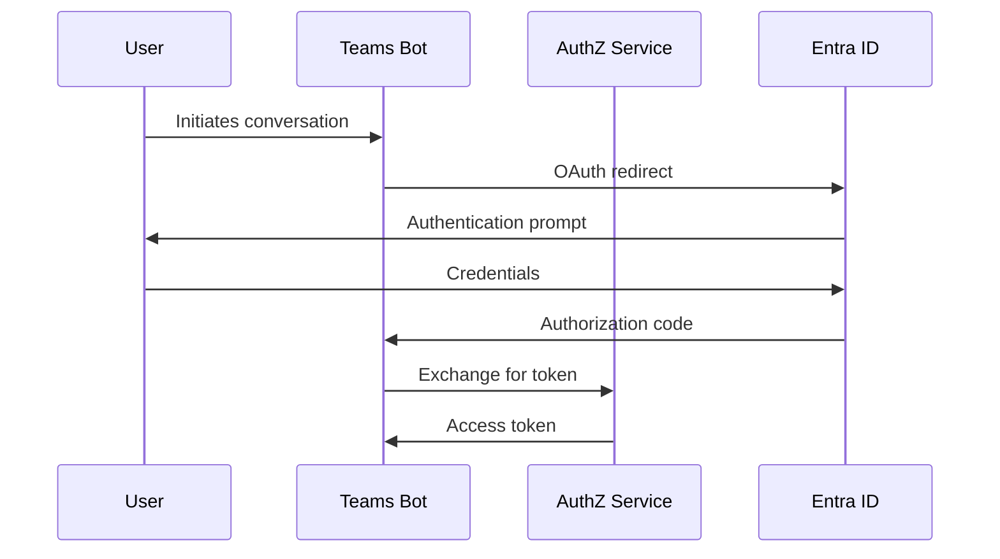

# API Reference

> **Complete API documentation for the Unstructured Data Indexing & AI-Query Application**

**Version**: 3.0  
**Last Updated**: 2025-01-27  
**Status**: Active Development

## Table of Contents

- [Overview](#overview)
- [Authentication & Security](#authentication--security)
- [Common Response Formats](#common-response-formats)
- [Error Handling](#error-handling)
- [Rate Limiting](#rate-limiting)
- [Service APIs](#service-apis)
  - [Orchestrator Service](#orchestrator-service)
  - [Authorization Service](#authorization-service)
  - [Ingestion Service](#ingestion-service)
  - [AI Pipeline Service](#ai-pipeline-service)
  - [Teams Bot Service](#teams-bot-service)
  - [Admin UI Service](#admin-ui-service)
  - [Cost Service](#cost-service)
  - [MCP Connector Services](#mcp-connector-services)
- [Webhook Endpoints](#webhook-endpoints)
- [Health Check Endpoints](#health-check-endpoints)
- [API Versioning](#api-versioning)

## Overview

The Unstructured Data Indexing & AI-Query Application exposes a comprehensive set of REST APIs across multiple microservices. All services follow consistent patterns for authentication, error handling, and response formatting.

### Base URLs

| Environment | Base URL | Description |
|-------------|----------|-------------|
| **Local Development** | `http://localhost:{PORT}` | Docker Compose services |
| **Production** | `https://api.{domain}.com` | Load-balanced production API |
| **Azure** | `https://{vm-ip}:{PORT}` | Azure VM deployment |

### Service Ports

| Service | Port | Purpose |
|---------|------|---------|
| **Orchestrator** | 8080 | Main API gateway |
| **Ingestion** | 8081 | Data ingestion pipeline |
| **Cost** | 8082 | Cost tracking & forecasting |
| **AuthZ** | 8083 | Authorization & security |
| **Pre-filter** | 8084 | Content preprocessing |
| **AI Pipeline** | 8085 | AI processing & embeddings |
| **MCP Box Server** | 8086 | Box integration |
| **MCP Files Server** | 8087 | SharePoint/OneDrive integration |
| **Teams Bot** | 3978 | Conversational interface |
| **Admin UI** | 3000 | Administrative interface |

## Authentication & Security

### OAuth 2.0 Flow

The application uses OAuth 2.0 with Microsoft Entra ID for authentication:



### Token Types

| Token Type | Purpose | Lifetime | Storage |
|------------|---------|----------|---------|
| **Access Token** | API calls | 1 hour | Encrypted in Key Vault |
| **Refresh Token** | Token renewal | 90 days | Encrypted in Key Vault |
| **ID Token** | User identity | 1 hour | Session storage |

### Security Headers

```http
Authorization: Bearer {access_token}
X-Tenant-ID: {tenant_id}
X-User-Principal: {user_principal_name}
X-Request-ID: {uuid}
```

## Common Response Formats

### Success Response

```json
{
  "status": "success",
  "data": {
    // Response data
  },
  "metadata": {
    "timestamp": "2025-01-27T00:00:00.000Z",
    "request_id": "uuid",
    "processing_time_ms": 150
  }
}
```

### Error Response

```json
{
  "status": "error",
  "error": {
    "code": "AUTHENTICATION_FAILED",
    "message": "Invalid or expired access token",
    "details": "Token expired at 2025-01-27T01:00:00.000Z"
  },
  "metadata": {
    "timestamp": "2025-01-27T00:00:00.000Z",
    "request_id": "uuid",
    "correlation_id": "uuid"
  }
}
```

### Paginated Response

```json
{
  "status": "success",
  "data": {
    "items": [],
    "pagination": {
      "page": 1,
      "page_size": 20,
      "total_items": 150,
      "total_pages": 8,
      "has_next": true,
      "has_previous": false
    }
  }
}
```

## Error Handling

### HTTP Status Codes

| Code | Category | Description |
|------|----------|-------------|
| **200** | Success | Request completed successfully |
| **201** | Created | Resource created successfully |
| **400** | Bad Request | Invalid request parameters |
| **401** | Unauthorized | Authentication required |
| **403** | Forbidden | Insufficient permissions |
| **404** | Not Found | Resource not found |
| **429** | Too Many Requests | Rate limit exceeded |
| **500** | Internal Error | Server-side error |

### Error Codes

| Error Code | Description | HTTP Status |
|------------|-------------|-------------|
| `AUTHENTICATION_FAILED` | Invalid or expired token | 401 |
| `INSUFFICIENT_PERMISSIONS` | User lacks required permissions | 403 |
| `RESOURCE_NOT_FOUND` | Requested resource doesn't exist | 404 |
| `VALIDATION_ERROR` | Request validation failed | 400 |
| `RATE_LIMIT_EXCEEDED` | Too many requests | 429 |
| `INTERNAL_ERROR` | Unexpected server error | 500 |

## Rate Limiting

### Limits by Service

| Service | Rate Limit | Window | Burst |
|---------|------------|--------|-------|
| **Orchestrator** | 1000 req/min | 1 minute | 100 |
| **Ingestion** | 100 req/min | 1 minute | 20 |
| **AI Pipeline** | 500 req/min | 1 minute | 50 |
| **AuthZ** | 2000 req/min | 1 minute | 200 |

### Rate Limit Headers

```http
X-RateLimit-Limit: 1000
X-RateLimit-Remaining: 850
X-RateLimit-Reset: 1640995200
X-RateLimit-Window: 60
```

## Service APIs

### Orchestrator Service

**Base URL**: `http://localhost:8080`  
**Purpose**: Main API gateway for query orchestration and security-aware data retrieval

#### Health Check

```http
GET /healthz
```

**Response**:
```json
{
  "status": "ok",
  "service": "orchestrator",
  "timestamp": "2025-01-27T00:00:00.000Z"
}
```

#### Secure Query (Primary Endpoint)

```http
GET /query_secure
```

**Parameters**:
- `upn` (required): User Principal Name
- `q` (required): Query text
- `tenant_id` (optional): Tenant ID (default: "default")
- `top_k` (optional): Number of results (default: 8)
- `include_tables` (optional): Include table generation (default: true)
- `include_charts` (optional): Include chart generation (default: true)

**Response**:
```json
{
  "query": "What are our Q3 financial results?",
  "answer": "Based on the available documents...",
  "citations": [
    {
      "title": "Q3 Financial Report",
      "source": "SharePoint/Finance",
      "file_id": "uuid",
      "confidence": 0.95
    }
  ],
  "tables": [
    {
      "title": "Q3 Financial Summary",
      "columns": ["Metric", "Q3 2024", "Q2 2024"],
      "rows": [
        ["Revenue", "$1.2M", "$1.1M"],
        ["Profit", "$150K", "$120K"]
      ]
    }
  ],
  "charts": [
    {
      "type": "line_chart",
      "title": "Revenue Trend",
      "data_url": "/api/charts/uuid"
    }
  ],
  "metadata": {
    "total_results": 5,
    "processing_time_ms": 1250,
    "security_trimmed": true
  }
}
```

#### Legacy Query (Deprecated)

```http
GET /query
```

**Parameters**:
- `q` (required): Query text
- `tenant_id` (optional): Tenant ID

**Note**: This endpoint is deprecated and will be removed in v4.0. Use `/query_secure` instead.

### Authorization Service

**Base URL**: `http://localhost:8083`  
**Purpose**: Principal resolution, security filtering, and access control

#### Health Check

```http
GET /healthz
```

#### Resolve Principals

```http
GET /resolve
```

**Parameters**:
- `upn` (required): User Principal Name
- `tenant_id` (required): Tenant ID
- `providers` (optional): List of providers ["box", "microsoft"] (default: both)

**Response**:
```json
{
  "upn": "user@company.com",
  "tenant_id": "tenant-uuid",
  "principals": [
    "user@company.com",
    "group:finance-team",
    "group:project-alpha"
  ],
  "groups": [
    "group:finance-team",
    "group:project-alpha"
  ],
  "resolved_at": "2025-01-27T00:00:00.000Z",
  "expires_at": "2025-01-27T00:15:00.000Z"
}
```

#### Get Current User Identity

```http
GET /whoami
```

**Headers**:
- `Authorization: Bearer {token}` (required)
- `X-Tenant-ID: {tenant_id}` (required)

**Response**:
```json
{
  "upn": "user@company.com",
  "tenant_id": "tenant-uuid",
  "object_id": "user-object-uuid"
}
```

#### Build Security Filter

```http
POST /filter
```

**Request Body**:
```json
{
  "upn": "user@company.com",
  "tenant_id": "tenant-uuid",
  "providers": ["box", "microsoft"]
}
```

**Response**:
```json
{
  "tenant_id": "tenant-uuid",
  "upn": "user@company.com",
  "filter_expression": "search.in(allowed_principals, 'user@company.com,group:finance-team,group:project-alpha')",
  "principals": ["user@company.com", "group:finance-team", "group:project-alpha"],
  "groups": ["group:finance-team", "group:project-alpha"]
}
```

### Ingestion Service

**Base URL**: `http://localhost:8081`  
**Purpose**: Data ingestion pipeline, change detection, and MCP integration

#### Health Check

```http
GET /healthz
```

#### Start Ingestion

```http
POST /start
```

**Request Body**:
```json
{
  "tenant_id": "tenant-uuid",
  "source": "box",
  "mode": "incremental",
  "paths": ["/Finance", "/HR"]
}
```

**Response**:
```json
{
  "status": "started",
  "tenant_id": "tenant-uuid",
  "source": "box",
  "mode": "incremental",
  "timestamp": "2025-01-27T00:00:00.000Z"
}
```

#### Stop Ingestion

```http
POST /stop
```

**Request Body**:
```json
{
  "tenant_id": "tenant-uuid",
  "source": "box"
}
```

#### Rescan Paths

```http
POST /rescan
```

**Request Body**:
```json
{
  "tenant_id": "tenant-uuid",
  "source": "sharepoint",
  "paths": ["/Projects/Alpha", "/Projects/Beta"]
}
```

#### Get Ingestion Status

```http
GET /status
```

**Parameters**:
- `tenant_id` (required): Tenant ID
- `source` (required): Source provider

**Response**:
```json
{
  "tenant_id": "tenant-uuid",
  "source": "box",
  "recent_activity": [
    {
      "timestamp": "2025-01-27T00:00:00.000Z",
      "status": "completed",
      "files_processed": 1250,
      "errors": 0
    }
  ]
}
```

### AI Pipeline Service

**Base URL**: `http://localhost:8085`  
**Purpose**: Enhanced AI processing with hierarchical metadata and intelligent chunking

#### Health Check

```http
GET /healthz
```

**Response**:
```json
{
  "status": "ok",
  "service": "enhanced-ai-pipeline",
  "version": "2.0.0",
  "timestamp": "2025-01-27T00:00:00.000Z",
  "features": [
    "hierarchical_metadata",
    "intelligent_chunking",
    "advanced_classification",
    "multi_level_caching",
    "contextual_retrieval"
  ]
}
```

#### Process Document (Enhanced)

```http
POST /process_enhanced
```

**Request Body**:
```json
{
  "file_id": "file-uuid",
  "tenant_id": "tenant-uuid",
  "source": "box",
  "file_path": "/Finance/Q3_Report.pdf",
  "content": "Document content...",
  "metadata": {
    "mime_type": "application/pdf",
    "size": 2048576
  },
  "processing_options": {
    "include_summary": true,
    "include_embeddings": true,
    "include_classification": true
  }
}
```

**Response**:
```json
{
  "status": "enhanced_processing_started",
  "file_id": "file-uuid",
  "tenant_id": "tenant-uuid",
  "pipeline_version": "2.0.0",
  "timestamp": "2025-01-27T00:00:00.000Z"
}
```

#### Intelligent Chunking

```http
POST /chunk_intelligent
```

**Request Body**:
```json
{
  "file_id": "file-uuid",
  "content": "Document content...",
  "tenant_id": "tenant-uuid",
  "metadata": {
    "mime_type": "text/markdown"
  }
}
```

#### Hierarchical Metadata Processing

```http
POST /metadata_hierarchical
```

**Request Body**:
```json
{
  "file_id": "file-uuid",
  "content": "Document content...",
  "tenant_id": "tenant-uuid",
  "metadata": {
    "mime_type": "application/pdf",
    "path": "/Finance/Q3_Report.pdf"
  }
}
```

### Teams Bot Service

**Base URL**: `http://localhost:3978`  
**Purpose**: Conversational interface with OAuth integration and adaptive cards

#### Health Check

```http
GET /healthz
```

**Response**:
```json
{
  "status": "ok",
  "service": "teams-bot",
  "timestamp": "2025-01-27T00:00:00.000Z"
}
```

#### Bot Messages Endpoint

```http
POST /api/messages
```

**Headers**:
- `Content-Type: application/json` (required)
- Bot Framework authentication headers

**Request Body**: Bot Framework activity object

**Response**: Bot Framework response

### Admin UI Service

**Base URL**: `http://localhost:3000`  
**Purpose**: Administrative interface for policy management and system monitoring

#### Health Check

```http
GET /healthz
```

#### Main Application

```http
GET /
```

**Response**: Next.js application with admin interface

### Cost Service

**Base URL**: `http://localhost:8082`  
**Purpose**: Cost tracking, forecasting, and budget management

#### Health Check

```http
GET /healthz
```

#### Get Cost Summary

```http
GET /cost/summary
```

**Parameters**:
- `tenant_id` (required): Tenant ID
- `period` (optional): Time period (default: "mtd")

**Response**:
```json
{
  "tenant_id": "tenant-uuid",
  "period": "mtd",
  "total_cost": 1250.75,
  "budget_limit": 2000.00,
  "forecast": 1800.00,
  "breakdown": {
    "ai_processing": 850.25,
    "storage": 250.50,
    "api_calls": 150.00
  }
}
```

### MCP Connector Services

#### Box MCP Server

**Base URL**: `http://localhost:8086`  
**Purpose**: Box integration via Model Context Protocol

#### Microsoft Files MCP Server

**Base URL**: `http://localhost:8087`  
**Purpose**: SharePoint/OneDrive integration via Model Context Protocol

## Webhook Endpoints

### Change Notification Webhook

```http
POST /webhooks/change-notification
```

**Headers**:
- `X-Provider: {provider}` (required)
- `X-Signature: {signature}` (required)

**Request Body**:
```json
{
  "event_type": "file_modified",
  "file_id": "file-uuid",
  "tenant_id": "tenant-uuid",
  "changes": {
    "modified_at": "2025-01-27T00:00:00.000Z",
    "version": "2.0",
    "etag": "new-etag"
  }
}
```

## Health Check Endpoints

All services expose a `/healthz` endpoint for health monitoring:

```bash
# Check all services
curl -s http://localhost:8080/healthz  # Orchestrator
curl -s http://localhost:8083/healthz  # AuthZ
curl -s http://localhost:8085/healthz  # AI Pipeline
curl -s http://localhost:3978/healthz  # Teams Bot
curl -s http://localhost:3000/healthz  # Admin UI
curl -s http://localhost:8081/healthz  # Ingestion
curl -s http://localhost:8084/healthz  # Pre-filter
curl -s http://localhost:8082/healthz  # Cost Service
curl -s http://localhost:8086/healthz  # MCP Box Server
curl -s http://localhost:8087/healthz  # MCP Files Server
```

## API Versioning

### Version Strategy

- **Current Version**: 3.0
- **Versioning Method**: URL path versioning
- **Deprecation Policy**: 6 months notice for breaking changes

### Version Endpoints

```http
# Current version (default)
GET /api/v3/query_secure

# Legacy version (deprecated)
GET /api/v2/query

# Future version
GET /api/v4/query_secure
```

### Breaking Changes

| Version | Breaking Changes | Migration Guide |
|---------|------------------|-----------------|
| **3.0** | None | N/A |
| **2.0** | Query endpoint changes | [Migration Guide](docs/MIGRATION_V2_TO_V3.md) |

---

**Next**: [Development Guide](DEVELOPMENT.md) | [Deployment Guide](DEPLOYMENT.md) | [Testing Guide](TESTING.md)

**Back to**: [README](../README.md) | [Architecture](ARCHITECTURE.md) | [Specification](SPECIFICATION.md)
