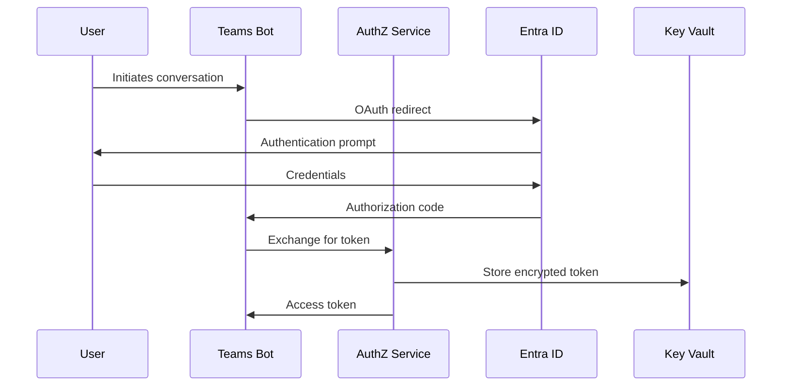

# Deployment Guide

> **Complete deployment guide for the Unstructured Data Indexing & AI-Query Application**

**Version**: 3.0  
**Last Updated**: 2025-01-27  
**Status**: Active Development

## Table of Contents

- [Overview](#overview)
- [Deployment Environments](#deployment-environments)
- [Prerequisites](#prerequisites)
- [Local Development Deployment](#local-development-deployment)
- [Azure Production Deployment](#azure-production-deployment)
- [Enhanced AI Pipeline Deployment](#enhanced-ai-pipeline-deployment)
- [Production Requirements](#production-requirements)
- [Monitoring & Observability](#monitoring--observability)
- [Scaling & Performance](#scaling--performance)
- [Security & Compliance](#security--compliance)
- [Backup & Disaster Recovery](#backup--disaster-recovery)
- [Troubleshooting](#troubleshooting)

## Overview

This guide covers the complete deployment process for the Unstructured Data Indexing & AI-Query Application across different environments. The system supports local development, Azure VM deployment, and production Azure Kubernetes Service (AKS) deployment.

### Deployment Philosophy

- **Infrastructure as Code**: All deployment configurations are version-controlled
- **Environment Parity**: Production-like testing in staging environments
- **Zero-Downtime Deployment**: Rolling updates with health checks
- **Security First**: Secure by default with comprehensive access controls
- **Monitoring Driven**: Full observability and alerting from day one

## Deployment Environments

### Environment Matrix

| Environment | Purpose | Infrastructure | Scaling | Security |
|-------------|---------|----------------|---------|----------|
| **Local Development** | Development & Testing | Docker Compose | Manual | Basic |
| **Azure VM** | Staging & Testing | Azure VM + Docker | Manual | Enhanced |
| **Azure AKS** | Production | Kubernetes Cluster | Auto | Production |

### Environment-Specific Configurations

```yaml
# Local Development
environment: development
log_level: DEBUG
enable_debug: true
resource_limits: minimal

# Azure VM Staging
environment: staging
log_level: INFO
enable_debug: false
resource_limits: moderate

# Production AKS
environment: production
log_level: WARN
enable_debug: false
resource_limits: production
```

## Prerequisites

### Common Prerequisites

| Component | Local | Azure VM | Production AKS |
|-----------|-------|----------|----------------|
| **Docker** | ✅ Required | ✅ Required | ✅ Required |
| **Docker Compose** | ✅ Required | ✅ Required | ❌ Not needed |
| **Azure CLI** | ❌ Optional | ✅ Required | ✅ Required |
| **Kubectl** | ❌ Not needed | ❌ Not needed | ✅ Required |
| **Domain Name** | ❌ Not needed | ✅ Required | ✅ Required |
| **SSL Certificate** | ❌ Not needed | ✅ Required | ✅ Required |

### Azure Prerequisites

```bash
# Install Azure CLI
curl -sL https://aka.ms/InstallAzureCLIDeb | sudo bash

# Authenticate with Azure
az login

# Set subscription
az account set --subscription "your-subscription-id"

# Install required extensions
az extension add --name containerapp
az extension add --name aks-preview
```

### Local Development Prerequisites

```bash
# Install Docker
curl -fsSL https://get.docker.com -o get-docker.sh
sudo sh get-docker.sh

# Install Docker Compose
sudo curl -L "https://github.com/docker/compose/releases/latest/download/docker-compose-$(uname -s)-$(uname -m)" -o /usr/local/bin/docker-compose
sudo chmod +x /usr/local/bin/docker-compose

# Verify installation
docker --version
docker-compose --version
```

## Local Development Deployment

### Quick Start

```bash
# Clone repository
git clone https://github.com/your-org/unstructured-data-bot.git
cd unstructured-data-bot

# Create environment file
cp .env.example .env
nano .env

# Start all services
docker-compose up -d --build

# Check service health
./scripts/health-check.sh
```

### Environment Configuration

**Required Environment Variables**:

```bash
# Azure Configuration
AZURE_OPENAI_ENDPOINT=https://your-openai.openai.azure.com/
AZURE_OPENAI_API_KEY=your-api-key
AZURE_SEARCH_ENDPOINT=https://your-search.search.windows.net/
AZURE_SEARCH_API_KEY=your-search-key
AZURE_KEY_VAULT_URL=https://your-vault.vault.azure.net/

# MongoDB Configuration
MONGODB_CONNECTION_STRING=mongodb://localhost:27017/unstructured_data

# Application Configuration
TENANT_ID=default
ENVIRONMENT=development
LOG_LEVEL=DEBUG
```

### Service Management

```bash
# Start specific service
docker-compose up -d orchestrator

# View logs
docker-compose logs -f orchestrator

# Restart service
docker-compose restart orchestrator

# Stop all services
docker-compose down

# Rebuild and restart
docker-compose up -d --build
```

### Health Monitoring

```bash
# Check all service health
curl -s http://localhost:8080/healthz  # Orchestrator
curl -s http://localhost:8083/healthz  # AuthZ
curl -s http://localhost:8085/healthz  # AI Pipeline
curl -s http://localhost:3978/healthz  # Teams Bot
curl -s http://localhost:3000/healthz  # Admin UI
curl -s http://localhost:8081/healthz  # Ingestion
curl -s http://localhost:8084/healthz  # Pre-filter
curl -s http://localhost:8082/healthz  # Cost Service
curl -s http://localhost:8086/healthz  # MCP Box Server
curl -s http://localhost:8087/healthz  # MCP Files Server
```

## Azure Production Deployment

### Azure Resource Provisioning

#### 1. Resource Group Creation

```bash
# Create resource groups
az group create --name "unstructured-data-rg" --location "East US"
az group create --name "unstructured-data-compute" --location "East US"
az group create --name "unstructured-data-network" --location "East US"
```

#### 2. Virtual Network Setup

```bash
# Create virtual network
az network vnet create \
  --resource-group "unstructured-data-network" \
  --name "unstructured-data-vnet" \
  --address-prefix "10.0.0.0/16" \
  --subnet-name "subnet-compute" \
  --subnet-prefix "10.0.1.0/24"

# Create network security group
az network nsg create \
  --resource-group "unstructured-data-network" \
  --name "unstructured-data-nsg"

# Configure NSG rules
az network nsg rule create \
  --resource-group "unstructured-data-network" \
  --nsg-name "unstructured-data-nsg" \
  --name "allow-http" \
  --protocol tcp \
  --priority 1000 \
  --destination-port-range 80

az network nsg rule create \
  --resource-group "unstructured-data-network" \
  --nsg-name "unstructured-data-nsg" \
  --name "allow-https" \
  --protocol tcp \
  --priority 1001 \
  --destination-port-range 443

az network nsg rule create \
  --resource-group "unstructured-data-network" \
  --nsg-name "unstructured-data-nsg" \
  --name "allow-ssh" \
  --protocol tcp \
  --priority 1002 \
  --destination-port-range 22
```

#### 3. Virtual Machine Creation

```bash
# Create VM with Docker pre-installed
az vm create \
  --resource-group "unstructured-data-compute" \
  --name "unstructured-data-vm" \
  --image "Canonical:0001-com-ubuntu-server-jammy:22_04-lts-gen2:latest" \
  --size "Standard_D4s_v3" \
  --admin-username "azureuser" \
  --ssh-key-values ~/.ssh/id_rsa.pub \
  --vnet-name "unstructured-data-vnet" \
  --subnet "subnet-compute" \
  --nsg "unstructured-data-nsg" \
  --public-ip-sku "Standard" \
  --custom-data cloud-init.yml

# Get VM public IP
az vm show \
  --resource-group "unstructured-data-compute" \
  --name "unstructured-data-vm" \
  --show-details \
  --query publicIps \
  --output tsv
```

#### 4. Cloud-Init Configuration

```yaml
# cloud-init.yml
#cloud-config
package_update: true
package_upgrade: true

packages:
  - docker.io
  - docker-compose
  - git
  - curl
  - wget
  - unzip

users:
  - name: azureuser
    groups: docker
    shell: /bin/bash

runcmd:
  # Install Docker Compose v2
  - curl -L "https://github.com/docker/compose/releases/latest/download/docker-compose-linux-x86_64" -o /usr/local/bin/docker-compose
  - chmod +x /usr/local/bin/docker-compose
  
  # Start Docker service
  - systemctl start docker
  - systemctl enable docker
  
  # Clone application repository
  - git clone https://github.com/your-org/unstructured-data-bot.git /opt/unstructured-data-bot
  
  # Set up environment
  - cd /opt/unstructured-data-bot
  - cp .env.example .env
  
  # Build and start services
  - docker-compose up -d --build
```

### Teams Bot Configuration

#### 1. Bot Registration

```bash
# Register Teams bot
az bot create \
  --resource-group "unstructured-data-rg" \
  --name "unstructured-data-bot" \
  --kind "bot" \
  --location "East US" \
  --endpoint "https://bot.yourdomain.com/api/messages" \
  --app-type "MultiTenant" \
  --sku "F0"

# Get bot credentials
az bot show \
  --resource-group "unstructured-data-rg" \
  --name "unstructured-data-bot" \
  --query "{appId:appId, appPassword:appPassword}" \
  --output table
```

#### 2. Bot Configuration

```bash
# Configure bot channels
az bot msteams create \
  --resource-group "unstructured-data-rg" \
  --name "unstructured-data-bot"

# Configure bot webhook
az bot webhook create \
  --resource-group "unstructured-data-rg" \
  --name "unstructured-data-bot" \
  --url "https://bot.yourdomain.com/api/messages" \
  --enable
```

### DNS Configuration

```bash
# Create DNS zone
az network dns zone create \
  --resource-group "unstructured-data-rg" \
  --name "yourdomain.com"

# Add A record for API
az network dns record-set a add-record \
  --resource-group "unstructured-data-rg" \
  --zone-name "yourdomain.com" \
  --record-set-name "api" \
  --ipv4-address "YOUR_VM_IP"

# Add A record for admin UI
az network dns record-set a add-record \
  --resource-group "unstructured-data-rg" \
  --zone-name "yourdomain.com" \
  --record-set-name "admin" \
  --ipv4-address "YOUR_VM_IP"

# Add A record for bot
az network dns record-set a add-record \
  --resource-group "unstructured-data-rg" \
  --zone-name "yourdomain.com" \
  --record-set-name "bot" \
  --ipv4-address "YOUR_VM_IP"
```

### SSL Certificate Setup

```bash
# Install Certbot
sudo apt update
sudo apt install certbot python3-certbot-nginx

# Obtain SSL certificates
sudo certbot --nginx \
  -d api.yourdomain.com \
  -d admin.yourdomain.com \
  -d bot.yourdomain.com

# Set up auto-renewal
sudo crontab -e
# Add: 0 12 * * * /usr/bin/certbot renew --quiet
```

### Nginx Configuration

```nginx
# /etc/nginx/sites-available/unstructured-data-bot
server {
    listen 80;
    server_name api.yourdomain.com admin.yourdomain.com bot.yourdomain.com;
    return 301 https://$server_name$request_uri;
}

server {
    listen 443 ssl http2;
    server_name api.yourdomain.com;
    
    ssl_certificate /etc/letsencrypt/live/api.yourdomain.com/fullchain.pem;
    ssl_certificate_key /etc/letsencrypt/live/api.yourdomain.com/privkey.pem;
    
    location / {
        proxy_pass http://localhost:8080;
        proxy_set_header Host $host;
        proxy_set_header X-Real-IP $remote_addr;
        proxy_set_header X-Forwarded-For $proxy_add_x_forwarded_for;
        proxy_set_header X-Forwarded-Proto $scheme;
    }
}

server {
    listen 443 ssl http2;
    server_name admin.yourdomain.com;
    
    ssl_certificate /etc/letsencrypt/live/admin.yourdomain.com/fullchain.pem;
    ssl_certificate_key /etc/letsencrypt/live/admin.yourdomain.com/privkey.pem;
    
    location / {
        proxy_pass http://localhost:3000;
        proxy_set_header Host $host;
        proxy_set_header X-Real-IP $remote_addr;
        proxy_set_header X-Forwarded-For $proxy_add_x_forwarded_for;
        proxy_set_header X-Forwarded-Proto $scheme;
    }
}

server {
    listen 443 ssl http2;
    server_name bot.yourdomain.com;
    
    ssl_certificate /etc/letsencrypt/live/bot.yourdomain.com/fullchain.pem;
    ssl_certificate_key /etc/letsencrypt/live/bot.yourdomain.com/privkey.pem;
    
    location / {
        proxy_pass http://localhost:3978;
        proxy_set_header Host $host;
        proxy_set_header X-Real-IP $remote_addr;
        proxy_set_header X-Forwarded-For $proxy_add_x_forwarded_for;
        proxy_set_header X-Forwarded-Proto $scheme;
    }
}
```

### Deployment Automation

```bash
# Automated deployment script
#!/bin/bash
# deploy-to-azure.sh

VM_NAME="unstructured-data-vm"
RESOURCE_GROUP="unstructured-data-compute"
REPO_URL="https://github.com/your-org/unstructured-data-bot.git"
DEPLOY_PATH="/opt/unstructured-data-bot"

echo "🚀 Deploying to Azure VM..."

# Check VM status
echo "📋 Checking VM status..."
az vm show \
  --resource-group $RESOURCE_GROUP \
  --name $VM_NAME \
  --query "powerState" \
  --output tsv

# Deploy via SSH
echo "📦 Deploying application..."
ssh azureuser@$VM_IP << 'EOF'
  cd $DEPLOY_PATH
  
  # Pull latest code
  git pull origin main
  
  # Stop existing containers
  docker-compose down
  
  # Pull latest images
  docker-compose pull
  
  # Start with latest code
  docker-compose up -d --build
  
  # Verify deployment
  docker-compose ps
  curl -s http://localhost:8080/healthz
EOF

echo "✅ Deployment completed!"
```

## Enhanced AI Pipeline Deployment

### Enhanced AI Pipeline Service

#### Build Requirements

```dockerfile
# docker/ai-pipeline/Dockerfile
FROM python:3.12-slim

WORKDIR /app

# Install system dependencies
RUN apt-get update && apt-get install -y \
    gcc \
    g++ \
    && rm -rf /var/lib/apt/lists/*

# Install Python dependencies
COPY requirements.txt .
RUN pip install --no-cache-dir -r requirements.txt

# Copy application code
COPY app/ ./app/

# Expose port
EXPOSE 8085

# Health check
HEALTHCHECK --interval=30s --timeout=10s --start-period=5s --retries=3 \
  CMD curl -f http://localhost:8085/healthz || exit 1

# Start service
CMD ["python", "-m", "uvicorn", "app.main:app", "--host", "0.0.0.0", "--port", "8085"]
```

#### Enhanced Dependencies

```txt
# services/ai-pipeline/requirements.txt
langchain==0.1.0
langchain-text-splitters==0.0.1
spacy==3.7.2
openai==1.6.1
azure-search-documents==11.4.0
transformers==4.36.0
sentence-transformers==2.2.2
fastapi==0.104.1
uvicorn==0.24.0
pydantic==2.5.0
redis==5.0.1
pymongo==4.6.0
```

#### Service Components

1. **EnhancedDocumentSummarizer** - Hierarchical summary generation
2. **IntelligentDocumentEmbedder** - Multi-vector embedding generation
3. **AdvancedSensitiveDataClassifier** - Confidence-based classification
4. **IntelligentChunker** - Adaptive chunking with semantic boundaries
5. **HierarchicalMetadataProcessor** - Multi-level metadata processing
6. **MetadataCacheManager** - Multi-level caching with TTL

### Enhanced Database Schema

#### MongoDB Collections Update

```javascript
// Enhanced files collection
db.files.updateMany({}, {
  $set: {
    "hierarchical_metadata": {
      "core": {},
      "content": {},
      "semantic": {},
      "security": {},
      "processing": {},
      "contextual": {}
    },
    "enhanced_summary_ref": {},
    "advanced_classification": {},
    "enhanced_ai_processed_at": null,
    "processing_version": "2.0.0"
  }
});

// Enhanced chunks collection
db.chunks.updateMany({}, {
  $set: {
    "metadata": {
      "chunk_type": "generic",
      "position": 0,
      "length": 0,
      "semantic_context": "",
      "entities": [],
      "sensitivity_flags": [],
      "embedding_model": "text-embedding-ada-002",
      "embedding_version": "1.0"
    }
  }
});
```

#### Index Creation

```javascript
// Enhanced indexes for performance
db.files.createIndex({ "tenant_id": 1, "source": 1, "modified_at": -1 });
db.files.createIndex({ "tenant_id": 1, "hierarchical_metadata.semantic.classification.sensitivity_flags": 1 });
db.files.createIndex({ "tenant_id": 1, "hierarchical_metadata.security.allowed_principals": 1 });
db.files.createIndex({ "tenant_id": 1, "hierarchical_metadata.core.path": 1 });
db.files.createIndex({ "tenant_id": 1, "hierarchical_metadata.contextual.department": 1 });

db.chunks.createIndex({ "file_id": 1, "chunk_id": 1 });
db.chunks.createIndex({ "tenant_id": 1, "file_id": 1 });
db.chunks.createIndex({ "metadata.chunk_type": 1 });
```

### Enhanced Azure AI Search Index

#### Index Schema Update

```json
{
  "name": "enhanced-documents-index",
  "fields": [
    {
      "name": "id",
      "type": "Edm.String",
      "key": true,
      "searchable": false
    },
    {
      "name": "tenant_id",
      "type": "Edm.String",
      "filterable": true,
      "searchable": false
    },
    {
      "name": "content",
      "type": "Edm.String",
      "searchable": true,
      "analyzer": "en.microsoft"
    },
    {
      "name": "contentVector",
      "type": "Collection(Edm.Single)",
      "searchable": true,
      "vectorSearchProfile": "my-vector-profile",
      "dimensions": 1536
    },
    {
      "name": "hierarchical_metadata",
      "type": "Edm.String",
      "searchable": true,
      "filterable": true
    },
    {
      "name": "allowed_principals",
      "type": "Collection(Edm.String)",
      "filterable": true,
      "searchable": false
    },
    {
      "name": "sensitivity_flags",
      "type": "Collection(Edm.String)",
      "filterable": true,
      "searchable": false
    }
  ],
  "vectorSearch": {
    "algorithmConfigurations": [
      {
        "name": "my-vector-profile",
        "kind": "hnsw"
      }
    ]
  }
}
```

## Production Requirements

### Critical Production Gaps

#### 1. Enterprise Authentication

```python
# MISSING: Production OAuth/OIDC implementation
- OAuth 2.0 with PKCE for Teams bot
- On-Behalf-Of (OBO) token exchange
- Entra ID integration with proper scopes
- Box OAuth with refresh token management
- Microsoft Graph API authentication
- Token caching and refresh mechanisms
- Role-based access control (RBAC)
```

#### 2. Security Trimming

```python
# MISSING: Production security implementation
- Principal resolution (user -> groups -> roles)
- Security filters for MongoDB queries
- Azure AI Search security trimming
- Per-tenant isolation
- Data encryption at rest and in transit
- Key Vault integration for secrets
- Audit logging for all access
```

#### 3. MongoDB Production Setup

```javascript
// MISSING: Production MongoDB schema
- Proper indexing strategy (compound, covering)
- Data model for all 8 collections
- Backup and restore procedures
- Connection pooling and monitoring
- Data migration scripts
- TTL indexes for cache cleanup
- Sharding strategy for scale
```

#### 4. Azure AI Search Integration

```python
# MISSING: Production search implementation
- Vector index configuration
- Hybrid search (vector + keyword)
- Security trimming in search queries
- Index management and optimization
- Semantic search capabilities
- Faceted search and filtering
```

### Production Implementation Roadmap

#### Phase 1: Security Foundation (Week 1-2)
- [ ] Implement OAuth 2.0 with PKCE
- [ ] Set up Entra ID integration
- [ ] Implement principal resolution
- [ ] Add security trimming

#### Phase 2: Data Layer (Week 3-4)
- [ ] Complete MongoDB schema
- [ ] Implement Azure AI Search
- [ ] Add backup procedures
- [ ] Set up monitoring

#### Phase 3: AI Pipeline (Week 5-6)
- [ ] Deploy enhanced AI pipeline
- [ ] Implement MCP servers
- [ ] Add cost tracking
- [ ] Performance optimization

#### Phase 4: Production Readiness (Week 7-8)
- [ ] Load testing
- [ ] Security testing
- [ ] Documentation completion
- [ ] Go-live preparation

## Monitoring & Observability

### Application Monitoring

#### Health Checks

```bash
# Comprehensive health check script
#!/bin/bash
# health-check.sh

SERVICES=(
  "orchestrator:8080"
  "authz:8083"
  "ai-pipeline:8085"
  "teams-bot:3978"
  "admin-ui:3000"
  "ingestion:8081"
  "pre-filter:8084"
  "cost:8082"
  "mcp-box:8086"
  "mcp-files:8087"
)

for service in "${SERVICES[@]}"; do
  IFS=':' read -r name port <<< "$service"
  
  if curl -s "http://localhost:$port/healthz" > /dev/null; then
    echo "✅ $name is healthy"
  else
    echo "❌ $name is unhealthy"
  fi
done
```

#### Logging Configuration

```yaml
# docker-compose.yml logging section
services:
  orchestrator:
    logging:
      driver: "json-file"
      options:
        max-size: "10m"
        max-file: "3"
  
  authz:
    logging:
      driver: "json-file"
      options:
        max-size: "10m"
        max-file: "3"
```

### Azure Monitor Integration

#### Application Insights

```bash
# Create Application Insights
az monitor app-insights component create \
  --app unstructured-data-insights \
  --location "East US" \
  --resource-group "unstructured-data-rg" \
  --application-type web

# Get instrumentation key
az monitor app-insights component show \
  --app unstructured-data-insights \
  --resource-group "unstructured-data-rg" \
  --query "instrumentationKey" \
  --output tsv
```

#### Custom Metrics

```python
# Custom metrics collection
from opencensus.ext.azure.log_exporter import AzureLogHandler
from opencensus.ext.azure.metrics_exporter import AzureMetricsExporter

# Set up metrics exporter
metrics_exporter = AzureMetricsExporter(
    connection_string='InstrumentationKey=your-key'
)

# Record custom metrics
metrics_exporter.record_metric(
    'query_response_time',
    response_time_ms,
    {'service': 'orchestrator', 'endpoint': '/query_secure'}
)
```

## Scaling & Performance

### Performance Targets

| Metric | Target | Measurement |
|--------|--------|-------------|
| **Query Response Time** | < 2 seconds | 95th percentile |
| **Ingestion Throughput** | > 1000 files/hour | Per tenant |
| **Concurrent Users** | > 100 | Without degradation |
| **Memory Usage** | < 2GB | Per service container |
| **CPU Utilization** | < 80% | Under normal load |

### Scaling Strategies

#### Horizontal Scaling

```yaml
# docker-compose.yml with scaling
services:
  orchestrator:
    deploy:
      replicas: 3
      resources:
        limits:
          cpus: '1.0'
          memory: 2G
        reservations:
          cpus: '0.5'
          memory: 1G
  
  ai-pipeline:
    deploy:
      replicas: 2
      resources:
        limits:
          cpus: '2.0'
          memory: 4G
```

#### Load Balancing

```nginx
# Nginx load balancer configuration
upstream orchestrator_backend {
    least_conn;
    server localhost:8080 weight=1 max_fails=3 fail_timeout=30s;
    server localhost:8080 weight=1 max_fails=3 fail_timeout=30s;
    server localhost:8080 weight=1 max_fails=3 fail_timeout=30s;
}

server {
    listen 443 ssl http2;
    server_name api.yourdomain.com;
    
    location / {
        proxy_pass http://orchestrator_backend;
        proxy_set_header Host $host;
        proxy_set_header X-Real-IP $remote_addr;
        proxy_set_header X-Forwarded-For $proxy_add_x_forwarded_for;
        proxy_set_header X-Forwarded-Proto $scheme;
    }
}
```

### Performance Optimization

#### Caching Strategy

```python
# Multi-level caching implementation
class MetadataCacheManager:
    def __init__(self):
        self.l1_cache = {}  # In-memory cache
        self.l2_cache = redis.Redis()  # Redis cache
        self.l3_cache = "mongodb"  # Database cache
    
    async def get_metadata(self, file_id: str) -> Optional[dict]:
        # Check L1 cache
        if file_id in self.l1_cache:
            return self.l1_cache[file_id]
        
        # Check L2 cache
        cached = await self.l2_cache.get(file_id)
        if cached:
            self.l1_cache[file_id] = cached
            return cached
        
        # Check L3 cache
        metadata = await self.get_from_db(file_id)
        if metadata:
            await self.l2_cache.set(file_id, metadata, ex=3600)
            self.l1_cache[file_id] = metadata
        
        return metadata
```

#### Database Optimization

```javascript
// MongoDB query optimization
// Use compound indexes for common query patterns
db.files.createIndex({
  "tenant_id": 1,
  "source": 1,
  "modified_at": -1,
  "hierarchical_metadata.security.allowed_principals": 1
});

// Use covered queries when possible
db.files.find(
  { "tenant_id": "tenant-1", "source": "box" },
  { "file_id": 1, "path": 1, "modified_at": 1 }
).hint({ "tenant_id": 1, "source": 1, "modified_at": -1 });
```

## Security & Compliance

### Security Architecture

#### Authentication Flow



#### Security Trimming Implementation

```python
# Security trimming in query processing
class SecurityTrimmer:
    def __init__(self, authz_service: AuthZService):
        self.authz_service = authz_service
    
    async def build_security_filter(self, user_principal: str, tenant_id: str) -> str:
        # Resolve user principals
        principals = await self.authz_service.resolve_principals(
            user_principal, tenant_id
        )
        
        # Build security filter
        principal_list = ",".join(principals)
        return f"search.in(allowed_principals, '{principal_list}')"
    
    async def apply_security_trimming(self, query: str, user_principal: str, tenant_id: str) -> str:
        security_filter = await self.build_security_filter(user_principal, tenant_id)
        
        # Apply security filter to query
        if "where" in query.lower():
            query += f" and {security_filter}"
        else:
            query += f" where {security_filter}"
        
        return query
```

### Compliance Features

#### Data Classification

```python
# Sensitive data classification
class SensitiveDataClassifier:
    def __init__(self):
        self.patterns = {
            'pii': [
                r'\b\d{3}-\d{2}-\d{4}\b',  # SSN
                r'\b[A-Za-z0-9._%+-]+@[A-Za-z0-9.-]+\.[A-Z|a-z]{2,}\b',  # Email
                r'\b\d{3}-\d{3}-\d{4}\b'  # Phone
            ],
            'phi': [
                r'\b(patient|medical|diagnosis|treatment)\b',
                r'\b\d{1,2}/\d{1,2}/\d{4}\b'  # Date
            ],
            'pci': [
                r'\b\d{4}[-\s]?\d{4}[-\s]?\d{4}[-\s]?\d{4}\b'  # Credit card
            ]
        }
    
    def classify_content(self, content: str) -> dict:
        classification = {}
        
        for category, patterns in self.patterns.items():
            matches = []
            for pattern in patterns:
                if re.search(pattern, content, re.IGNORECASE):
                    matches.append(pattern)
            
            if matches:
                classification[category] = {
                    'confidence': len(matches) / len(patterns),
                    'patterns_found': matches
                }
        
        return classification
```

#### Audit Logging

```python
# Comprehensive audit logging
class AuditLogger:
    def __init__(self, mongo_client):
        self.db = mongo_client.audit_logs
    
    async def log_access(self, user_id: str, resource: str, action: str, result: str):
        log_entry = {
            'timestamp': datetime.utcnow(),
            'user_id': user_id,
            'resource': resource,
            'action': action,
            'result': result,
            'ip_address': self.get_client_ip(),
            'user_agent': self.get_user_agent(),
            'session_id': self.get_session_id()
        }
        
        await self.db.access_logs.insert_one(log_entry)
    
    async def log_security_decision(self, user_id: str, decision: str, reason: str):
        log_entry = {
            'timestamp': datetime.utcnow(),
            'user_id': user_id,
            'decision': decision,
            'reason': reason,
            'context': self.get_security_context()
        }
        
        await self.db.security_logs.insert_one(log_entry)
```

## Backup & Disaster Recovery

### Backup Strategy

#### Database Backups

```bash
# MongoDB backup script
#!/bin/bash
# backup-mongodb.sh

BACKUP_DIR="/opt/backups/mongodb"
DATE=$(date +%Y%m%d_%H%M%S)
BACKUP_NAME="mongodb_backup_$DATE"

# Create backup directory
mkdir -p $BACKUP_DIR

# Perform backup
mongodump \
  --uri="mongodb://localhost:27017/unstructured_data" \
  --out="$BACKUP_DIR/$BACKUP_NAME"

# Compress backup
tar -czf "$BACKUP_DIR/$BACKUP_NAME.tar.gz" -C "$BACKUP_DIR" "$BACKUP_NAME"

# Remove uncompressed backup
rm -rf "$BACKUP_DIR/$BACKUP_NAME"

# Upload to Azure Blob Storage
az storage blob upload \
  --account-name "yourstorageaccount" \
  --container-name "backups" \
  --name "mongodb/$BACKUP_NAME.tar.gz" \
  --file "$BACKUP_DIR/$BACKUP_NAME.tar.gz"

# Clean up old backups (keep last 30 days)
find $BACKUP_DIR -name "*.tar.gz" -mtime +30 -delete

echo "Backup completed: $BACKUP_NAME.tar.gz"
```

#### Configuration Backups

```bash
# Configuration backup script
#!/bin/bash
# backup-config.sh

CONFIG_DIR="/opt/unstructured-data-bot"
BACKUP_DIR="/opt/backups/config"
DATE=$(date +%Y%m%d_%H%M%S)
BACKUP_NAME="config_backup_$DATE"

# Create backup directory
mkdir -p $BACKUP_DIR

# Backup configuration files
tar -czf "$BACKUP_DIR/$BACKUP_NAME.tar.gz" \
  -C $CONFIG_DIR \
  .env \
  docker-compose.yml \
  scripts/ \
  docs/

# Upload to Azure Blob Storage
az storage blob upload \
  --account-name "yourstorageaccount" \
  --container-name "backups" \
  --name "config/$BACKUP_NAME.tar.gz" \
  --file "$BACKUP_DIR/$BACKUP_NAME.tar.gz"

echo "Configuration backup completed: $BACKUP_NAME.tar.gz"
```

### Disaster Recovery

#### Recovery Procedures

```bash
# Disaster recovery script
#!/bin/bash
# disaster-recovery.sh

RECOVERY_DATE=$1
BACKUP_CONTAINER="backups"

if [ -z "$RECOVERY_DATE" ]; then
    echo "Usage: $0 YYYYMMDD_HHMMSS"
    exit 1
fi

echo "🚨 Starting disaster recovery for date: $RECOVERY_DATE"

# Download MongoDB backup
echo "📥 Downloading MongoDB backup..."
az storage blob download \
  --account-name "yourstorageaccount" \
  --container-name $BACKUP_CONTAINER \
  --name "mongodb/mongodb_backup_$RECOVERY_DATE.tar.gz" \
  --file "/tmp/mongodb_backup_$RECOVERY_DATE.tar.gz"

# Download configuration backup
echo "📥 Downloading configuration backup..."
az storage blob download \
  --account-name "yourstorageaccount" \
  --container-name $BACKUP_CONTAINER \
  --name "config/config_backup_$RECOVERY_DATE.tar.gz" \
  --file "/tmp/config_backup_$RECOVERY_DATE.tar.gz"

# Stop services
echo "🛑 Stopping services..."
docker-compose down

# Restore MongoDB
echo "🔄 Restoring MongoDB..."
tar -xzf "/tmp/mongodb_backup_$RECOVERY_DATE.tar.gz" -C /tmp
mongorestore \
  --uri="mongodb://localhost:27017/unstructured_data" \
  --drop \
  "/tmp/mongodb_backup_$RECOVERY_DATE"

# Restore configuration
echo "🔄 Restoring configuration..."
tar -xzf "/tmp/config_backup_$RECOVERY_DATE.tar.gz" -C /opt/unstructured-data-bot

# Start services
echo "🚀 Starting services..."
docker-compose up -d

# Verify recovery
echo "✅ Verifying recovery..."
sleep 30
curl -s http://localhost:8080/healthz

echo "🎉 Disaster recovery completed!"
```

## Troubleshooting

### Common Issues

#### 1. Service Won't Start

```bash
# Check service logs
docker-compose logs <service-name>

# Check service status
docker-compose ps

# Check resource usage
docker stats

# Restart specific service
docker-compose restart <service-name>
```

#### 2. Connection Issues

```bash
# Check network connectivity
docker-compose exec <service> ping <target-service>

# Verify environment variables
docker-compose exec <service> env | grep AZURE

# Check service health endpoints
curl http://localhost:8080/healthz
```

#### 3. Performance Issues

```bash
# Check resource usage
docker stats --no-stream

# Check MongoDB performance
db.currentOp()

# Check Azure AI Search performance
curl -H "api-key: $AZURE_SEARCH_API_KEY" \
  "https://$AZURE_SEARCH_ENDPOINT/indexes/enhanced-documents-index/stats?api-version=2023-11-01"
```

### Debug Mode

```bash
# Enable debug logging
export LOG_LEVEL=DEBUG
export DEBUG=true

# Start services with debug
docker-compose up -d --build

# View debug logs
docker-compose logs -f --tail=100
```

### Performance Diagnostics

```bash
# Performance testing script
#!/bin/bash
# performance-test.sh

echo "🚀 Running performance tests..."

# Test query response time
echo "📊 Testing query response time..."
for i in {1..10}; do
    start_time=$(date +%s%N)
    curl -s "http://localhost:8080/query_secure?q=test&upn=user@company.com" > /dev/null
    end_time=$(date +%s%N)
    response_time=$(( (end_time - start_time) / 1000000 ))
    echo "Query $i: ${response_time}ms"
done

# Test concurrent users
echo "👥 Testing concurrent users..."
ab -n 100 -c 10 "http://localhost:8080/healthz"

# Test memory usage
echo "💾 Checking memory usage..."
docker stats --no-stream --format "table {{.Container}}\t{{.CPUPerc}}\t{{.MemUsage}}"
```

---

**Next**: [Testing Guide](TESTING.md) | [Operations Guide](OPERATIONS.md) | [User Guide](USER_GUIDE.md)

**Back to**: [README](../README.md) | [API Reference](API_REFERENCE.md) | [Development Guide](DEVELOPMENT.md)
